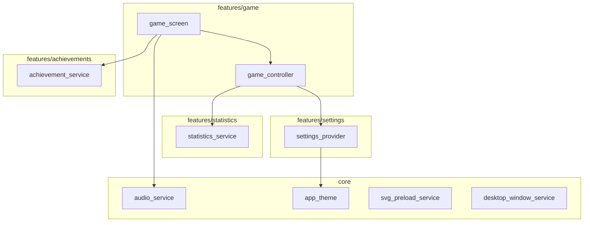

# Feature-First Architecture Migration Plan

## Project: Solitude (Flutter Solitaire App)
## Branch: restructure-by-feature

---

## Executive Summary

This document outlines the migration from a **Layer-First** structure (organized by file type: models/, services/, screens/, widgets/) to a **Feature-First** structure (organized by domain: features/game/, features/settings/, etc.).

### Current State
- The `achievements/` folder is already feature-based
- All other code uses layer-first organization
- Files are spread across: `models/`, `services/`, `screens/`, `widgets/`, `theme/`, `utils/`, `games/`

### Target State
```
lib/
├── main.dart
├── core/                    # Shared logic across features
│   ├── theme/
│   ├── utils/
│   ├── widgets/
│   └── services/
└── features/                # Domain-specific modules
    ├── achievements/        # Already exists - keep as-is
    ├── game/
    ├── settings/
    ├── statistics/
    └── home/
```

---

## File Migration Mapping

### 1. features/game/ - Core Gameplay Domain

All files related to card games, game logic, board rendering, and game state.

#### models/
| Current Path | New Path |
|-------------|----------|
| `lib/models/card.dart` | `lib/features/game/models/card.dart` |
| `lib/models/deck.dart` | `lib/features/game/models/deck.dart` |
| `lib/models/pile.dart` | `lib/features/game/models/pile.dart` |
| `lib/models/move.dart` | `lib/features/game/models/move.dart` |
| `lib/models/pile_render_data.dart` | `lib/features/game/models/pile_render_data.dart` |
| `lib/models/draw_mode.dart` | `lib/features/game/models/draw_mode.dart` |

> **Note:** `game_event.dart` moved to `core/models/` - see Core section below.

#### services/
| Current Path | New Path |
|-------------|----------|
| `lib/services/game_controller.dart` | `lib/features/game/services/game_controller.dart` |
| `lib/services/board_layout_service.dart` | `lib/features/game/services/board_layout_service.dart` |
| `lib/services/solitaire_bot.dart` | `lib/features/game/services/solitaire_bot.dart` |
| `lib/services/animation_state_notifier.dart` | `lib/features/game/services/animation_state_notifier.dart` |
| `lib/services/hint_state_notifier.dart` | `lib/features/game/services/hint_state_notifier.dart` |
| `lib/services/selection_state_notifier.dart` | `lib/features/game/services/selection_state_notifier.dart` |
| `lib/services/timer_state_notifier.dart` | `lib/features/game/services/timer_state_notifier.dart` |
| `lib/services/game_audio_observer.dart` | `lib/features/game/services/game_audio_observer.dart` |

#### screens/
| Current Path | New Path |
|-------------|----------|
| `lib/screens/game_screen.dart` | `lib/features/game/screens/game_screen.dart` |
| `lib/screens/game_chooser_screen.dart` | `lib/features/game/screens/game_chooser_screen.dart` |

#### widgets/
| Current Path | New Path |
|-------------|----------|
| `lib/widgets/card_widget.dart` | `lib/features/game/widgets/card_widget.dart` |
| `lib/widgets/pile_widget.dart` | `lib/features/game/widgets/pile_widget.dart` |
| `lib/widgets/game_board.dart` | `lib/features/game/widgets/game_board.dart` |
| `lib/widgets/animated_card_overlay.dart` | `lib/features/game/widgets/animated_card_overlay.dart` |
| `lib/widgets/focused_pile_wrapper.dart` | `lib/features/game/widgets/focused_pile_wrapper.dart` |
| `lib/widgets/game_layout_delegate.dart` | `lib/features/game/widgets/game_layout_delegate.dart` |
| `lib/widgets/pile_indicator.dart` | `lib/features/game/widgets/pile_indicator.dart` |
| `lib/widgets/svg_card_renderer.dart` | `lib/features/game/widgets/svg_card_renderer.dart` |
| `lib/widgets/card_gloss_painter.dart` | `lib/features/game/widgets/card_gloss_painter.dart` |
| `lib/widgets/win_animation.dart` | `lib/features/game/widgets/win_animation.dart` |

#### games/ (game variants)
| Current Path | New Path |
|-------------|----------|
| `lib/games/game_interface.dart` | `lib/features/game/games/game_interface.dart` |
| `lib/games/game_factory.dart` | `lib/features/game/games/game_factory.dart` |
| `lib/games/solitaire_game_base.dart` | `lib/features/game/games/solitaire_game_base.dart` |
| `lib/games/klondike/klondike_game.dart` | `lib/features/game/games/klondike/klondike_game.dart` |

---

### 2. features/settings/ - Settings Domain

All files related to user preferences, difficulty configuration, and theme selection.

#### models/
| Current Path | New Path |
|-------------|----------|
| `lib/models/difficulty.dart` | `lib/features/settings/models/difficulty.dart` |
| `lib/models/theme_preset.dart` | `lib/features/settings/models/theme_preset.dart` |

#### services/
| Current Path | New Path |
|-------------|----------|
| `lib/services/settings_provider.dart` | `lib/features/settings/services/settings_provider.dart` |

#### screens/
| Current Path | New Path |
|-------------|----------|
| `lib/screens/settings_screen.dart` | `lib/features/settings/screens/settings_screen.dart` |

#### widgets/
| Current Path | New Path |
|-------------|----------|
| `lib/widgets/theme_preview_cards.dart` | `lib/features/settings/widgets/theme_preview_cards.dart` |
| `lib/widgets/volume_slider.dart` | `lib/features/settings/widgets/volume_slider.dart` |
| `lib/widgets/game_toggle.dart` | `lib/features/settings/widgets/game_toggle.dart` |

---

### 3. features/statistics/ - Statistics Domain

All files related to game statistics tracking and display.

#### services/
| Current Path | New Path |
|-------------|----------|
| `lib/services/statistics_service.dart` | `lib/features/statistics/services/statistics_service.dart` |

#### screens/
| Current Path | New Path |
|-------------|----------|
| `lib/screens/statistics_screen.dart` | `lib/features/statistics/screens/statistics_screen.dart` |

---

### 4. features/achievements/ - Achievements Domain

**Already feature-based - NO CHANGES NEEDED**

Current structure is correct:
```
lib/achievements/
├── models/
│   ├── achievement.dart
│   ├── achievement.g.dart
│   ├── achievement_category.dart
│   └── achievement_category_adapter.dart
└── services/
    ├── achievement_observer.dart
    └── achievement_service.dart
```

---

### 5. features/home/ - Home/Navigation Domain

Screens and widgets for app startup, navigation, and informational pages.

#### screens/
| Current Path | New Path |
|-------------|----------|
| `lib/screens/loading_splash_screen.dart` | `lib/features/home/screens/loading_splash_screen.dart` |
| `lib/screens/about_screen.dart` | `lib/features/home/screens/about_screen.dart` |
| `lib/screens/help_screen.dart` | `lib/features/home/screens/help_screen.dart` |

#### widgets/
| Current Path | New Path |
|-------------|----------|
| `lib/widgets/app_startup_wrapper.dart` | `lib/features/home/widgets/app_startup_wrapper.dart` |

---

### 6. core/ - Shared Infrastructure

Files used across multiple features.

#### models/ (shared contracts)
| Current Path | New Path |
|-------------|----------|
| `lib/models/game_event.dart` | `lib/core/models/game_event.dart` |

> **Rationale:** `GameEvent` is a shared contract used by both `GameController` (features/game) and `AchievementObserver` (features/achievements). Placing it in core allows better decoupling between features.

#### theme/
| Current Path | New Path |
|-------------|----------|
| `lib/theme/app_theme.dart` | `lib/core/theme/app_theme.dart` |

#### utils/
| Current Path | New Path |
|-------------|----------|
| `lib/utils/layout_calculator.dart` | `lib/core/utils/layout_calculator.dart` |
| `lib/utils/overlay_validator.dart` | `lib/core/utils/overlay_validator.dart` |

#### widgets/ (generic UI components)
| Current Path | New Path |
|-------------|----------|
| `lib/widgets/game_button.dart` | `lib/core/widgets/game_button.dart` |
| `lib/widgets/game_toolbar.dart` | `lib/core/widgets/game_toolbar.dart` |
| `lib/widgets/move_history_viewer.dart` | `lib/core/widgets/move_history_viewer.dart` |

#### services/ (global services)
| Current Path | New Path |
|-------------|----------|
| `lib/services/audio_service.dart` | `lib/core/services/audio_service.dart` |
| `lib/services/svg_preload_service.dart` | `lib/core/services/svg_preload_service.dart` |
| `lib/services/desktop_window_service.dart` | `lib/core/services/desktop_window_service.dart` |

---

## Target Directory Structure

```
lib/
├── main.dart
├── core/
│   ├── models/
│   │   └── game_event.dart    # Shared contract for decoupling
│   ├── theme/
│   │   └── app_theme.dart
│   ├── utils/
│   │   ├── layout_calculator.dart
│   │   └── overlay_validator.dart
│   ├── widgets/
│   │   ├── game_button.dart
│   │   ├── game_toolbar.dart
│   │   └── move_history_viewer.dart
│   └── services/
│       ├── audio_service.dart
│       ├── svg_preload_service.dart
│       └── desktop_window_service.dart
└── features/
    ├── achievements/          # UNCHANGED - already feature-based
    │   ├── models/
    │   │   ├── achievement.dart
    │   │   ├── achievement.g.dart
    │   │   ├── achievement_category.dart
    │   │   └── achievement_category_adapter.dart
    │   └── services/
    │       ├── achievement_observer.dart
    │       └── achievement_service.dart
    ├── game/
    │   ├── models/
    │   │   ├── card.dart
    │   │   ├── deck.dart
    │   │   ├── draw_mode.dart
    │   │   ├── move.dart
    │   │   ├── pile.dart
    │   │   └── pile_render_data.dart
    │   ├── services/
    │   │   ├── animation_state_notifier.dart
    │   │   ├── board_layout_service.dart
    │   │   ├── game_audio_observer.dart
    │   │   ├── game_controller.dart
    │   │   ├── hint_state_notifier.dart
    │   │   ├── selection_state_notifier.dart
    │   │   ├── solitaire_bot.dart
    │   │   └── timer_state_notifier.dart
    │   ├── screens/
    │   │   ├── game_chooser_screen.dart
    │   │   └── game_screen.dart
    │   ├── widgets/
    │   │   ├── animated_card_overlay.dart
    │   │   ├── card_gloss_painter.dart
    │   │   ├── card_widget.dart
    │   │   ├── focused_pile_wrapper.dart
    │   │   ├── game_board.dart
    │   │   ├── game_layout_delegate.dart
    │   │   ├── pile_indicator.dart
    │   │   ├── pile_widget.dart
    │   │   ├── svg_card_renderer.dart
    │   │   └── win_animation.dart
    │   └── games/
    │       ├── game_factory.dart
    │       ├── game_interface.dart
    │       ├── solitaire_game_base.dart
    │       └── klondike/
    │           └── klondike_game.dart
    ├── settings/
    │   ├── models/
    │   │   ├── difficulty.dart
    │   │   └── theme_preset.dart
    │   ├── services/
    │   │   └── settings_provider.dart
    │   ├── screens/
    │   │   └── settings_screen.dart
    │   └── widgets/
    │       ├── game_toggle.dart
    │       ├── theme_preview_cards.dart
    │       └── volume_slider.dart
    ├── statistics/
    │   ├── services/
    │   │   └── statistics_service.dart
    │   └── screens/
    │       └── statistics_screen.dart
    └── home/
        ├── screens/
        │   ├── about_screen.dart
        │   ├── help_screen.dart
        │   └── loading_splash_screen.dart
        └── widgets/
            └── app_startup_wrapper.dart
```

---

## Import Strategy

### Within a Feature
Use **relative imports** for files in the same feature:
```dart
// Inside features/game/services/game_controller.dart
import '../models/card.dart';
import '../models/pile.dart';
import '../widgets/animated_card_overlay.dart';
```

### Cross-Feature and Core Imports
Use **package imports** for cross-feature dependencies and core modules:
```dart
// Inside features/game/services/game_controller.dart
import 'package:solitude/features/settings/services/settings_provider.dart';
import 'package:solitude/features/statistics/services/statistics_service.dart';
import 'package:solitude/core/services/audio_service.dart';
```

---

## Critical Dependencies to Preserve

### Hive TypeAdapters
The following files contain Hive-generated code and must stay together:
- `lib/features/achievements/models/achievement.dart` + `achievement.g.dart`
- `lib/features/achievements/models/achievement_category_adapter.dart`

**Action:** Ensure `main.dart` still registers these adapters correctly after migration.

### Cross-Feature Dependencies



---

## Execution Order

### Phase 1: Create Directory Structure
1. Create `lib/core/` with subdirectories: `theme/`, `utils/`, `widgets/`, `services/`
2. Create `lib/features/` with subdirectories for each feature
3. Move `lib/achievements/` to `lib/features/achievements/`

### Phase 2: Move Core Files
1. Move `lib/theme/app_theme.dart` → `lib/core/theme/`
2. Move `lib/utils/*` → `lib/core/utils/`
3. Move shared widgets → `lib/core/widgets/`
4. Move global services → `lib/core/services/`

### Phase 3: Move Feature Files
1. Move game-related files → `lib/features/game/`
2. Move settings-related files → `lib/features/settings/`
3. Move statistics-related files → `lib/features/statistics/`
4. Move home-related files → `lib/features/home/`

### Phase 4: Fix Imports
1. Update all imports in moved files
2. Update `main.dart` imports
3. Update test file imports

### Phase 5: Cleanup
1. Delete empty directories: `lib/models/`, `lib/services/`, `lib/screens/`, `lib/widgets/`, `lib/games/`, `lib/theme/`, `lib/utils/`
2. Run `flutter analyze`
3. Run `flutter test`

---

## Files to Update After Migration

### main.dart - Import Changes Required
```dart
// OLD
import 'services/settings_provider.dart';
import 'services/statistics_service.dart';
import 'services/board_layout_service.dart';
// ... etc

// NEW  
import 'features/settings/services/settings_provider.dart';
import 'features/statistics/services/statistics_service.dart';
import 'features/game/services/board_layout_service.dart';
import 'features/game/services/animation_state_notifier.dart';
import 'features/game/services/hint_state_notifier.dart';
import 'features/game/services/selection_state_notifier.dart';
import 'features/game/services/timer_state_notifier.dart';
import 'core/services/svg_preload_service.dart';
import 'core/services/audio_service.dart';
import 'core/services/desktop_window_service.dart';
import 'features/achievements/services/achievement_service.dart';
import 'features/achievements/models/achievement.dart';
import 'features/achievements/models/achievement_category_adapter.dart';
import 'core/theme/app_theme.dart';
import 'features/home/screens/loading_splash_screen.dart';
import 'features/home/widgets/app_startup_wrapper.dart';
```

---

## Constraints Checklist

- [ ] NO logic changes - only file moves and import updates
- [ ] Hive TypeAdapters remain reachable from main.dart
- [ ] All .g.dart files move with their source files
- [ ] Tests continue to pass after migration
- [ ] flutter analyze passes with no errors

---

## Risk Mitigation

1. **Git commits:** Make atomic commits after each phase for easy rollback
2. **Run tests:** After each phase, run `flutter test` to catch breakages early
3. **IDE support:** Use IDE refactoring tools where possible for safer renames
4. **Import verification:** After migration, run `flutter analyze` to catch any broken imports

---

## Summary Statistics

| Category | File Count |
|----------|------------|
| features/game/ | 24 files |
| features/settings/ | 6 files |
| features/statistics/ | 2 files |
| features/achievements/ | 6 files (no change) |
| features/home/ | 4 files |
| core/ | 6 files |
| **Total** | **48 files** |
